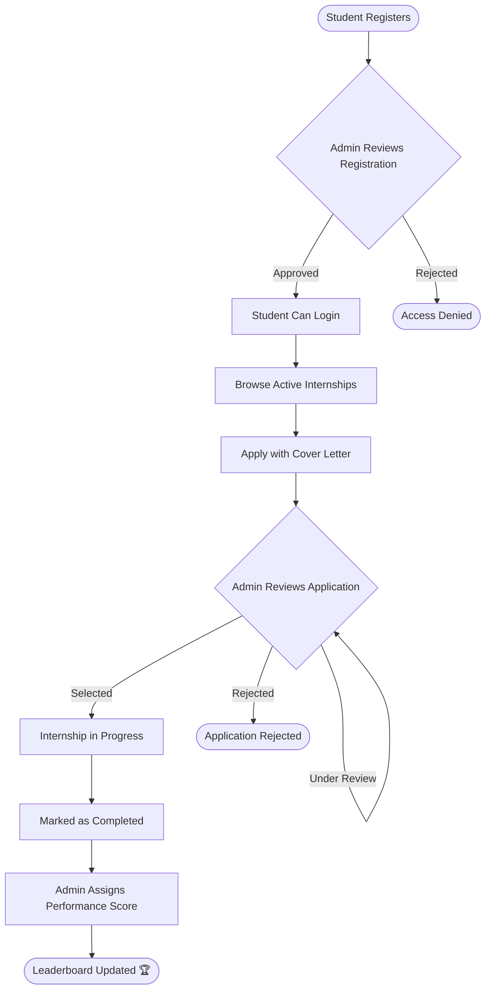

# 🎓 Internship Management Platform

> **Day 2 — Product Thinking & Design Challenge**
> Xebia Internship Program | Activity 1: Product Design Exercise

A full-stack **MERN** web application that streamlines the complete internship lifecycle — from posting opportunities and managing applications to scoring performance and ranking students — with dedicated portals for **Admins** and **Students**.

---

## 👥 User Roles

| Role | Description |
|---|---|
| **Admin** | Manages the platform — approves students, posts internships, reviews applications, assigns scores |
| **Student** | Registers, browses internships, applies, tracks status, views scores and leaderboard |

---

## ✨ Key Features

### 👨‍💼 Admin Portal
- Approve or reject student registrations
- Post, edit, and close internship listings
- Review applications and update their lifecycle status
- Assign performance scores (skills, attendance, task completion, feedback)
- View ranked leaderboard and audit logs of all actions

### 🎓 Student Portal
- Register and get approved by admin before login
- Browse active internship listings with filters
- Apply with a cover letter (one application per internship)
- Track application status in real-time (Pending → Under Review → Selected / Rejected / Completed)
- View personal score card after internship completion
- View public leaderboard and manage profile + resume

---

## 🔄 Workflow Diagram



---

## 🗺 Wireframes (Screen Map)

```
┌──────────────────────────────────────────────────────────────┐
│                        AUTH SCREENS                          │
│  ┌─────────────┐        ┌─────────────────────────────────┐  │
│  │  Login Page │        │        Register Page            │  │
│  │  Email      │        │  Name | Email | Phone           │  │
│  │  Password   │        │  Password | Skills | Education  │  │
│  │  [Login]    │        │  [Register → Pending Approval]  │  │
│  └─────────────┘        └─────────────────────────────────┘  │
└──────────────────────────────────────────────────────────────┘

┌──────────────────────────────────────────────────────────────┐
│                     ADMIN PORTAL                             │
│  Sidebar: Dashboard | Students | Internships |               │
│           Applications | Score Management | Leaderboard      │
│                                                              │
│  Dashboard   → Stats cards (users, applications, scores)     │
│  Students    → Table: Approve / Reject / Deactivate          │
│  Internships → Create / Edit / Close listings                │
│  Applications→ Status updates per application                │
│  Score Mgmt  → Assign scores to completed internships        │
│  Leaderboard → Ranked table of all students                  │
└──────────────────────────────────────────────────────────────┘

┌──────────────────────────────────────────────────────────────┐
│                    STUDENT PORTAL                            │
│  Sidebar: Dashboard | Browse | My Applications |             │
│           My Score | Leaderboard | Profile | Notifications   │
│                                                              │
│  Dashboard      → Welcome card, quick stats                  │
│  Browse         → Internship cards with Apply button         │
│  My Applications→ Status timeline per application            │
│  My Score       → Score breakdown card                       │
│  Leaderboard    → Public ranking                             │
│  Profile        → Edit info, upload resume & photo           │
│  Notifications  → In-app alerts from admin                   │
└──────────────────────────────────────────────────────────────┘
```

---

## 🚦 API Routes

### Auth — `/api/auth`
| Method | Route | Description |
|---|---|---|
| POST | `/register` | Student registration |
| POST | `/login` | Login & set JWT cookie |
| POST | `/logout` | Clear session |
| GET | `/me` | Logged-in user profile |

### Admin — `/api/admin`
| Method | Route | Description |
|---|---|---|
| GET | `/users` | List all users |
| PATCH | `/users/:id/approve` | Approve or reject student |
| PATCH | `/users/:id/status` | Activate / deactivate account |
| GET | `/audit-logs` | View admin action history |

### Internships — `/api/internships`
| Method | Route | Description |
|---|---|---|
| GET | `/` | List all active internships |
| POST | `/` | Create internship (Admin) |
| PUT | `/:id` | Update internship (Admin) |
| DELETE | `/:id` | Delete internship (Admin) |

### Applications — `/api/applications`
| Method | Route | Description |
|---|---|---|
| POST | `/` | Apply to an internship |
| GET | `/my` | Student's own applications |
| GET | `/` | All applications (Admin) |
| PATCH | `/:id/status` | Update application status (Admin) |

### Scores — `/api/scores`
| Method | Route | Description |
|---|---|---|
| POST | `/assign` | Assign / update score (Admin) |
| GET | `/leaderboard` | Ranked leaderboard |
| GET | `/my` | Student's own score history |
| GET | `/` | All scores (Admin) |

### Students — `/api/students`
| Method | Route | Description |
|---|---|---|
| GET | `/profile` | View own profile |
| PUT | `/profile` | Update profile, resume & photo |
| GET | `/notifications` | In-app notifications |

---

## 📦 MVP Definition

The **Minimum Viable Product** covers the core loop that makes the platform functional end-to-end:

| # | Feature | Status |
|---|---|---|
| 1 | Student registration with admin approval gate | ✅ Done |
| 2 | JWT-based login with role-based routing | ✅ Done |
| 3 | Admin can post and manage internships | ✅ Done |
| 4 | Students can browse and apply to internships | ✅ Done |
| 5 | Admin can update application status | ✅ Done |
| 6 | Admin can assign performance scores | ✅ Done |
| 7 | Leaderboard ranked by total score | ✅ Done |
| 8 | Student profile with resume upload | ✅ Done |
| 9 | In-app notifications | ✅ Done |
| 10 | Audit logs for all admin actions | ✅ Done |

---

## 🛠 Tech Stack

### Frontend
| Package | Purpose |
|---|---|
| **React 18** | UI component library |
| **Vite** | Dev server & bundler |
| **Tailwind CSS v4** | Utility-first styling |
| **React Router v6** | Client-side routing |
| **Axios** | HTTP client with interceptors |
| **React Context API** | Global auth & theme state |
| **React Hook Form** | Form handling & validation |
| **Recharts** | Dashboard charts |
| **Lucide React** | Icon library |
| **React Hot Toast** | Toast notifications |

### Backend
| Package | Purpose |
|---|---|
| **Node.js + Express** | REST API server |
| **MongoDB + Mongoose** | Database & ODM |
| **JWT + bcryptjs** | Auth & password hashing |
| **Multer** | File uploads (resume, photo) |
| **Morgan** | Request logging |
| **cookie-parser** | HTTP-only cookie support |
| **dotenv** | Environment variable management |

---

## 📁 Project Structure

```
Internship_Management_Platform/
├── backend/
│   ├── config/          # MongoDB connection
│   ├── controllers/     # authController, adminController, studentController,
│   │                    # internshipController, applicationController, scoreController
│   ├── middleware/      # authMiddleware, roleMiddleware, auditMiddleware,
│   │                    # uploadMiddleware, errorMiddleware
│   ├── models/          # User, Internship, Application, InternshipScore,
│   │                    # Notification, AuditLog
│   ├── routes/          # One file per resource
│   ├── services/        # scoreService (business logic)
│   ├── utils/           # generateToken, apiResponse
│   ├── seed.js          # Default admin seeder
│   └── server.js        # Entry point
│
└── frontend/
    └── src/
        ├── api/         # Axios calls per module
        ├── context/     # AuthContext, ThemeContext
        ├── hooks/       # useAuth, useTheme
        ├── components/  # Navbar, Sidebar, Cards, ProtectedRoute, AdminRoute
        └── pages/
            ├── auth/    # Login, Register
            ├── admin/   # Dashboard, Students, Internships, Applications,
            │            # Score Management, Leaderboard
            └── student/ # Dashboard, Browse, My Applications, My Score,
                         # Leaderboard, Profile, Notifications
```

---

## 🔐 Environment Setup

**`backend/.env`**
```env
MONGO_URI=mongodb://localhost:27017/internship_platform
JWT_SECRET=your_secret_key_here
JWT_EXPIRES_IN=7d
PORT=5001
CLIENT_URL=http://localhost:5174
NODE_ENV=development
```

**`frontend/.env`**
```env
VITE_API_URL=http://localhost:5001
```

---

## 🚀 Getting Started

```bash
# 1. Clone
git clone https://github.com/ArvinSaini/Internship_Management_Platform_Xebia.git
cd Internship_Management_Platform_Xebia

# 2. Backend
cd backend && npm install
node seed.js        # Creates default admin
npm run dev         # → http://localhost:5001

# 3. Frontend
cd ../frontend && npm install
npm run dev         # → http://localhost:5174
```

### Default Admin Login
| Email | Password |
|---|---|
| `admin@internship.com` | `Admin@123` |

> ⚠️ Change the password after first login.

---

## 📄 License

Developed for the **Xebia Internship Program**. All rights reserved.
